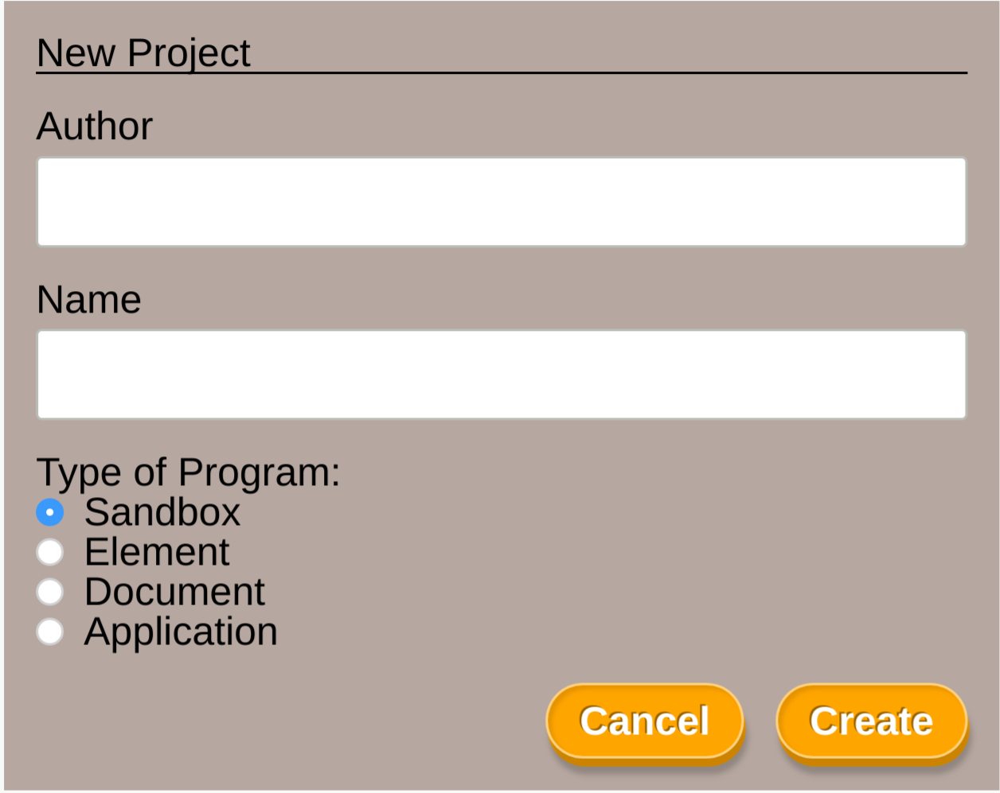

# Grove

## ⚠️ W.I.P. ⚠️

A tool for those who don't like to or don't want to use the command line for their Elm projects.

## Features:

- [x] Create project
- [x] Edit project in your default editor (see [table](https://github.com/wolfadex/grove#supported-editors) for list of supported editors)
- [x] Start a dev server when editing
- [x] Delete projects
- [x] Eject projects
- [ ] Run tests
- [x] Build for production
- [ ] Manage Elm dependencies
  - [ ] Display dependencies
  - [ ] Add dependency
  - [ ] Remove dependency
  - [ ] Upgrade dependency
- [x] Show stats for prod builds

## Supported Editors:

| Value           | Editor                                                                 | Linux | Windows | OSX |
| --------------- | ---------------------------------------------------------------------- | :---: | :-----: | :-: |
| `appcode`       | [AppCode](https://www.jetbrains.com/objc/)                             |       |         |  ✓  |
| `atom`          | [Atom](https://atom.io/)                                               |   ✓   |    ✓    |  ✓  |
| `atom-beta`     | [Atom Beta](https://atom.io/beta)                                      |       |         |  ✓  |
| `brackets`      | [Brackets](http://brackets.io/)                                        |   ✓   |    ✓    |  ✓  |
| `clion`         | [Clion](https://www.jetbrains.com/clion/)                              |       |    ✓    |  ✓  |
| `code`          | [Visual Studio Code](https://code.visualstudio.com/)                   |   ✓   |    ✓    |  ✓  |
| `code-insiders` | [Visual Studio Code Insiders](https://code.visualstudio.com/insiders/) |   ✓   |    ✓    |  ✓  |
| `emacs`         | [Emacs](https://www.gnu.org/software/emacs/)                           |   ✓   |         |     |
| `idea`          | [IDEA](https://www.jetbrains.com/idea/)                                |   ✓   |    ✓    |  ✓  |
| `notepad++`     | [Notepad++](https://notepad-plus-plus.org/download/v7.5.4.html)        |       |    ✓    |     |
| `pycharm`       | [PyCharm](https://www.jetbrains.com/pycharm/)                          |   ✓   |    ✓    |  ✓  |
| `phpstorm`      | [PhpStorm](https://www.jetbrains.com/phpstorm/)                        |   ✓   |    ✓    |  ✓  |
| `rubymine`      | [RubyMine](https://www.jetbrains.com/ruby/)                            |   ✓   |    ✓    |  ✓  |
| `sublime`       | [Sublime Text](https://www.sublimetext.com/)                           |   ✓   |    ✓    |  ✓  |
| `vim`           | [Vim](http://www.vim.org/)                                             |   ✓   |         |     |
| `visualstudio`  | [Visual Studio](https://www.visualstudio.com/vs/)                      |       |         |  ✓  |
| `webstorm`      | [WebStorm](https://www.jetbrains.com/webstorm/)                        |   ✓   |    ✓    |  ✓  |

\*Based on the editors that [launch-editor](https://github.com/yyx990803/launch-editor) supports.

## Contributing

Any and all contributions are welcome!

### Development Build

- Clone repo
- Run `yarn` to install dependencies
- Run `yarn dev` to start the app in development mode

The app has 2 main parts, the server (written in JS/Node) and the client (written in Elm). The client does most of the work, only calling back to the server when it needs data from disk or needs to write to disk.

The current structure of a project made with Grove is:

- a minimal html file that points to a javascript file
- a minimal javascript file that loads an elm file
- a minimal elm file based off 1 of the 4 Browser programs

This is then built with [Parcel](https://parceljs.org/). The project is by default stored within the directory structure of Gove, which allows Parcel to use the already installed `node_modules` making for super fast startup of new projects.

### Production Build

Thre aren't any production builds yet as this is still a work in progress, pre-alpha.
